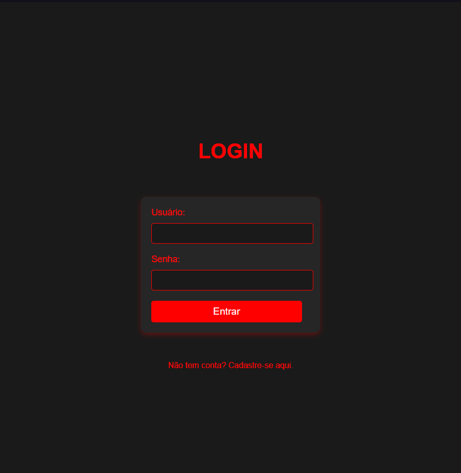
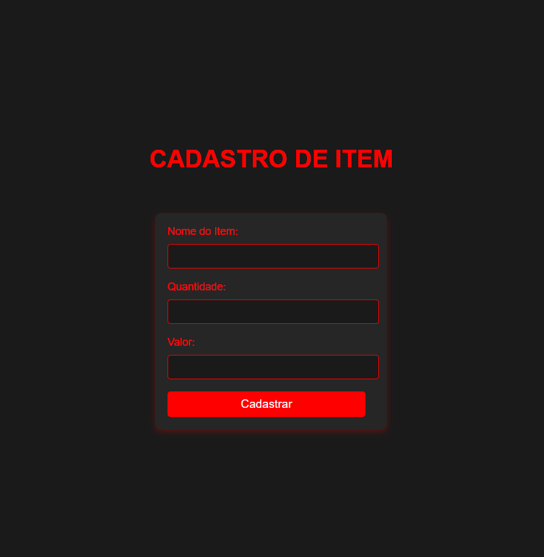

# Projeto Access Point

Este projeto é uma aplicação web projetada para gerenciar pontos de acesso de forma eficiente. Ele inclui funcionalidades para autenticação e gerenciamento de usuários. Abaixo está uma descrição detalhada do projeto.

## Funcionalidades

- Login e cadastro de usuários.
- Gerenciamento de acesso a rotas específicas.
- Cadastro simples de itens com campos de quantidade, nome e valor.

## Tecnologias Utilizadas

- Python (framework Flask)
- HTML/CSS para o frontend
- SQLite - A implementar...

## Instruções de Configuração

1. Clone o repositório ou extraia os arquivos baixados.
2. Navegue até o diretório do projeto.
3. Crie um ambiente virtual:
   ```bash
   python -m venv .venv
   ```
4. Ative o ambiente virtual:
   - No Windows:
     ```bash
     .venv\Scripts\activate
     ```
   - No Mac/Linux:
     ```bash
     source .venv/bin/activate
     ```
5. Instale as dependências:
   ```bash
   pip install -r requirements.txt
   ```
6. Execute a aplicação:
   ```bash
   python app.py
   ```
7. Abra seu navegador e acesse `http://127.0.0.1:5000`.

---

## Estrutura do Projeto

```
AccessPoint/
├── app.py         # Arquivo principal da aplicação
├── templates/     # Templates HTML
├── static/        # Arquivos estáticos (CSS, JS, Imagens)
├── README.md      # Documentação do projeto
└── requirements.txt # Dependências
```

---

## Capturas de Tela

Abaixo estão os espaços reservados para as capturas de tela do projeto:






## Licença

Este projeto está licenciado sob a Licença MIT. Veja o arquivo LICENSE para mais detalhes.

---

Sinta-se à vontade para contribuir com o projeto e torná-lo ainda melhor! 🚀
